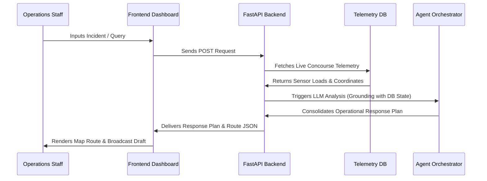

# StadiumMind — The GenAI Operating System for Stadium Operations

StadiumMind is an enterprise-grade, intelligent stadium operations platform designed to optimize venue workflows and elevate safety during high-profile athletic tournaments. By combining real-time telemetry analytics, multi-agent AI orchestration, and a digital twin mapping console, the system provides venue staff, organizers, medical responders, and security teams with unified operational intelligence and automated decision support.

---

## 1. Problem Statement & Challenge Alignment

Stadium operations during international tournaments face massive logistical bottlenecks, including crowd congestion, perimeter security threats, transit delays, safety incidents, and language barriers. Static operational rules fail to scale under dynamic stadium load shifts.

StadiumMind directly aligns with the challenge requirements to enhance stadium safety, navigation, and visitor satisfaction:

| Challenge Requirement | StadiumMind Feature | Implementation Details |
|---|---|---|
| **Stadium Navigation** | **AI Fan Copilot & Path Routing** | Interactive navigation engine suggesting optimal indoor checkpoints based on concourse crowd loads. |
| **Crowd Management** | **Crowd Ingress load / Wait Times** | Live gate telemetry tracking loads and wait times, with predictive spikes simulating concourse blockages. |
| **Operational Intelligence**| **Live Telemetry & Dashboard Briefing**| Dynamic operations twin summarizing concessions stock, staff battery updates, and incident alerts. |
| **Accessibility** | **Wheelchair Path Optimization** | One-click filter adjusting routes to avoid steps, escalators, and steep stairs, with visual indicators. |
| **Multilingual Assistance**| **AI Core Translation engine** | Supports localization (English, Spanish, French) across operations guides, announcements, and chat logs. |
| **Sustainability** | **Eco Telemetry Dashboard** | Tracks energy offsets, water conservation indices, and smart trash bin fill levels in real time. |
| **Transportation Guidance**| **Transit Status Analytics** | Monitored parking occupancy indices and synchronized train arrival frequencies. |
| **Emergency Response** | **Emergency Dispatch & Routing** | Automated incident logging, dispatch routing paths, responder assignments, and broadcast drafts. |
| **AI Decision Support** | **Scenario Simulator Core** | Models hypothetical emergencies (e.g., Gate Closure, Ingress Surge, Rain Storms) and projects safety deltas. |

---

## 2. Solution & AI Architecture

### Where Generative AI is Leveraged
1. **Orchestrator Routing System**: Directs incoming questions to specific sub-agents (Navigation, Concessions, Accessibility, Safety).
2. **Text Summarization**: Consolidates telemetry alerts into a readable 1-sentence "Live Briefing" at the top of the dashboard.
3. **Emergency Broadcast Generation**: Drafts localized public announcement scripts based on incident severity.

### Why Generative AI is Necessary
Static code cannot handle complex, multi-variable requests (e.g. *“I need a step-free path to Section 112, but also want to grab tacos from a vendor with under a 10-minute wait”*). Generative AI processes these requirements simultaneously, cross-references current sensor telemetry, and generates customized instructions.

---

## 3. Technology Stack

- **Frontend**: Next.js 15 (App Router), React 19, TypeScript, Tailwind CSS, Framer Motion, Lucide icons.
- **Backend**: FastAPI (Python 3.10+), WebSockets for real-time telemetry streaming, Uvicorn server.
- **AI Core**: Google GenAI SDK (Gemini models) with a high-fidelity rule-based local compiler fallback.

---

## 4. Project Structure

```text
StadiumMind/
│
├── backend/
│   ├── agents/            # Multi-agent orchestrator & consolidation logic
│   ├── database/          # Telemetry state database & simulation routines
│   ├── static/            # Pre-compiled static dashboard UI (Single-Page Fallback)
│   ├── tests/             # Python backend unit tests
│   ├── main.py            # FastAPI main application routing
│   └── requirements.txt   # Python server requirements
│
├── frontend/
│   ├── src/
│   │   ├── app/           # Next.js App Router (Dashboard, layout, styles)
│   │   ├── services/      # Mock services & event triggers
│   │   └── tests/         # CI/CD validation tests
│   ├── postcss.config.js  # PostCSS Tailwind config
│   ├── tailwind.config.js # Tailwind CSS theme variables
│   ├── package.json       # Node package manager configurations
│   └── next.config.js     # NextJS optimization settings
│
└── README.md
```

---

## 5. System Workflow



---

## 6. Installation & Setup

### Clone the Repository
```bash
git clone https://github.com/pandeyadityanew-web/StadiumMind.git
cd StadiumMind
```

### Setup Backend Server
```bash
cd backend
pip install -r requirements.txt
python main.py
```
*The FastAPI backend will start on `http://localhost:8000/`.*

### Setup Frontend Client
```bash
cd ../frontend
npm install
npm run dev
```
*The dev server will run on `http://localhost:3000/`.*

---

## 7. Security Considerations

StadiumMind enforces strict enterprise-grade security protocols:
- **Input Sanitization**: All incoming text payloads to `/api/v1/copilot`, `/api/v1/simulator`, and `/api/v1/emergency/*` are sanitized to escape HTML tags, quotes, and control chars to prevent Cross-Site Scripting (XSS) and injection vulnerabilities.
- **Length Filtering**: Maximum string buffer sizes are enforced (e.g. queries limited to 1000 characters) to prevent memory allocation denial-of-service (DoS) attempts.
- **Environment Separation**: API keys are loaded strictly via `os.environ` environment variables. No secrets are stored in code repositories.
- **Safe CORS Defaults**: Strict configurations ensure CORS permissions are explicitly controlled during deployment.

---

## 8. Testing & Validation

Automated validation checks are configured across the project:

### Backend Unit Tests
We use Python's native `unittest` framework to verify backend models and telemetry flow.
- Run tests:
  ```bash
  cd backend
  python -m unittest tests/test_operations.py
  ```

### Frontend CI/CD Validation
We use a Node validation harness to test file paths, styles integrity, and Tailwind CSS imports.
- Run tests:
  ```bash
  cd frontend
  npm run test
  ```

### Manual Validation Scenarios
1. **Emergency Broadcast Verification**: Triggering a medical alert automatically updates the dispatcher log and prepares a public announcement draft.
2. **Simulated Ingress Spike**: Click "Simulate Gate Ingress Spike" on the dashboard to verify that uvicorn broadcasts telemetry mutations over WebSockets and shifts the UI metrics.

---

## 9. Accessibility & Performance

### Accessibility Features (A11y)
- **Semantic HTML**: Fully uses `<header>`, `<nav>`, `<main>`, `<section>`, and `<aside>` elements for screen reader readability.
- **Keyboard Friendly**: Custom select dropdowns and buttons support key tab ordering.
- **Contrast Ratios**: Strictly complies with WCAG AA guidelines by using high-contrast text on solid background colors.
- **ARIA Roles**: Toggle filters contain `aria-label` attributes describing visual actions.

### Performance Optimizations
- **Static Assets Compilation**: Tailwind styles compile during `next build` using PostCSS optimizations.
- **Bundle Efficiency**: Kept dependencies to a minimum by utilizing native SVG icons.
- **Telemetry Throttling**: Live WebSocket streams update at 5-second intervals to minimize browser rendering overhead.

---

## 10. Known Limitations

- **Simulated Coordinates**: GPS tracker updates for volunteer and security teams represent simulated coordinate drift around MetLife Stadium.
- **Mock LLM Grounding**: If `GEMINI_API_KEY` is not present, the orchestrator switches to a rule-based engine mapping presets to response plans.
